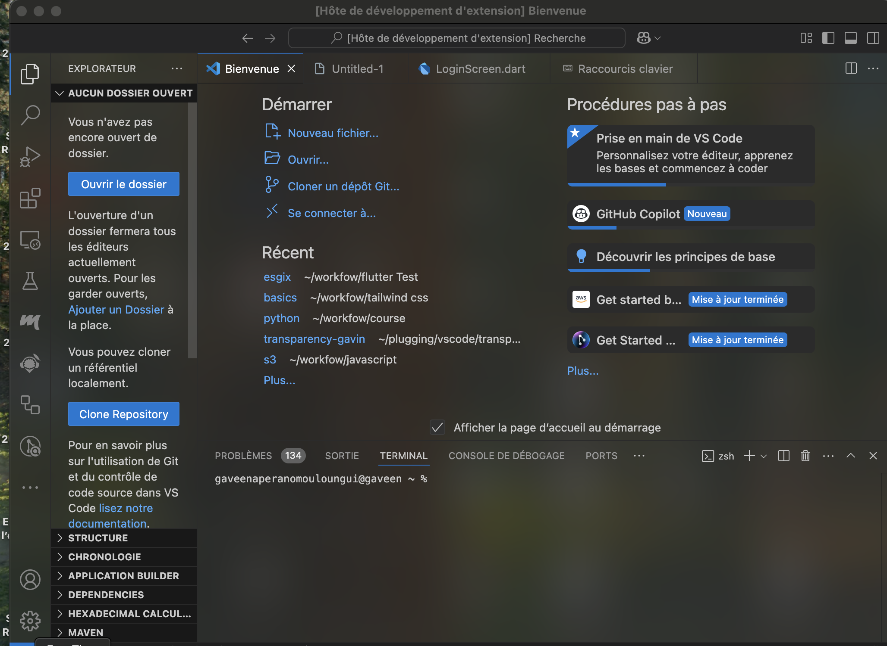

Transparency Gavin
==================
This is a simple extension that allows you to change the transparency of the editor in Visual Studio Code.

I would love some help or even some feedback on this project, so feel free to open an issue or a pull request.

i will really appreciate a star on the github 

repository : https://github.com/AperanoGavin/Vs-code-extension-transparency
